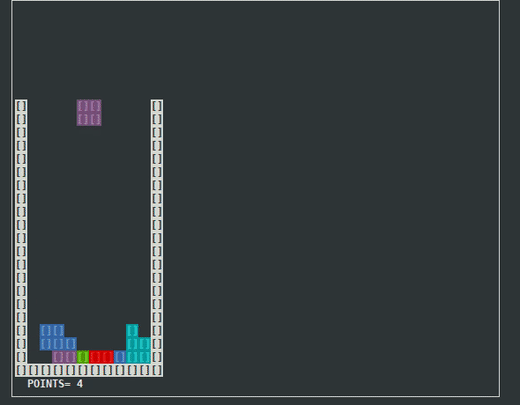

# Tetris Game


A simple Tetris Game made with game library created in the chapter 6 of *Programação em C++ - Conceitos Básicos e Algoritmos* by *Pimenta Rodrigues, Pedro Pereira e Manuela Sousa*.

## Intro
Random pieces fall into the board. The objective is to complete lines in order to obtain points. If there is no more space upwards, the game ends.

## Movements
You play using the following controls:
```
i key     -> moves left
o key     -> rotate
p key     -> moves right
Space key -> moves imediately down
ESC key   -> Quit
```
## Dependencies for compiling
Linux - Ubuntu
```
sudo apt install g++
sudo apt install libncurses5-dev libncursesw5-dev
```
For windows users you just need MinGW32

## Compiling

```
git clone https://github.com/HenriqueIII/Tetris-Game.git
cd Tetris-Game
make
```
## Download
Download at: (choose the version to your os)
> https://github.com/HenriqueIII/Tetris-Game/releases

## Start
```
bin/main
```
## Questions
If you have any question about the code, or some improvements please contact me at:
> paulogoncalves.m@gmail.com
